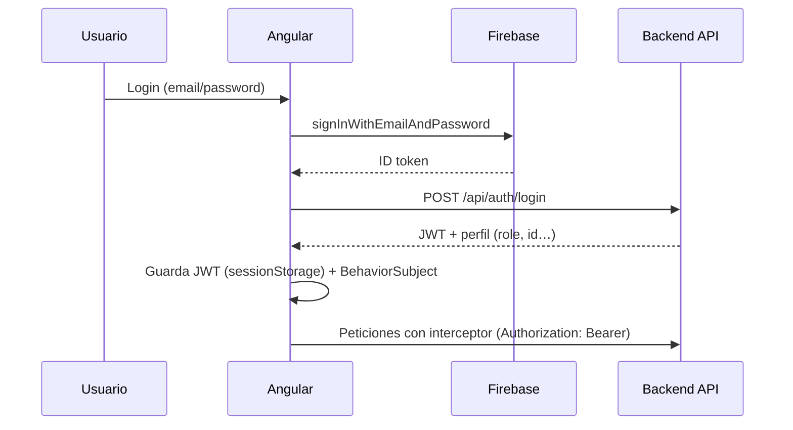

# Ziryab — Frontend Angular

Cliente web (**SPA**) del proyecto **Ziryab**, plataforma de gestión educativa para centros formativos. Interfaz por roles para alumnado, profesorado y administración, consumiendo la API REST Node/Express.

Parte del **Trabajo Fin de Grado / Proyecto Intermodular** del CPIFP Alan Turing (2º DAM, 2025–2026).

| Recurso | Enlace |
| --- | --- |
| Proyecto completo | [TFG-Ziryab](../TFG-Ziryab) |
| Backend API | [ZiryabBack](https://github.com/yo164/ZiryabBack) |
| App en producción | [ziryabfront.onrender.com](https://ziryabfront.onrender.com/) |
| Compodoc (docs) | [ziryab-compodoc](https://antoniosalces.github.io/ziryab-compodoc/index.html) |
| Jira | Proyecto `CURSO` |

---

## Índice

- [Stack tecnológico](#stack-tecnológico)
- [Funcionalidades por rol](#funcionalidades-por-rol)
- [Arquitectura](#arquitectura)
- [Inicio rápido](#inicio-rápido)
- [Configuración (`environment`)](#configuración-environment)
- [Autenticación](#autenticación)
- [Rutas principales](#rutas-principales)
- [Internacionalización](#internacionalización)
- [Estilos](#estilos)
- [Testing](#testing)
- [Documentación Compodoc](#documentación-compodoc)
- [Despliegue](#despliegue)
- [Convenciones de desarrollo](#convenciones-de-desarrollo)

---

## Stack tecnológico

| Capa | Tecnología |
| --- | --- |
| Framework | **Angular 19** (standalone components, sin NgModules) |
| Lenguaje | **TypeScript** ~5.7 |
| Estilos | **Tailwind CSS 3** + SCSS puntual |
| Estado reactivo | **RxJS** (`BehaviorSubject`) — migración gradual a signals |
| HTTP | `HttpClient` + interceptor JWT |
| Autenticación | **Firebase Auth** (`@angular/fire`) + JWT del backend |
| i18n | **ngx-translate** (es, en, de, ko) |
| Tests | **Jasmine** + **Karma** |
| Documentación | **Compodoc** |
| Despliegue | **Render** (build estático) |

---

## Funcionalidades por rol

### Alumno (`STUDENT`)

| Funcionalidad | Ruta / componente |
| --- | --- |
| Dashboard | `/dashboard` |
| Mis clases | `/clases` |
| Horario personal | `/horario-alumno` |
| Temario por clase | `/temario/:claseId` |
| Detalle y entrega de tarea | `/tarea/:id` (lazy) |
| Mis evaluaciones / notas | `/mis-evaluaciones` |
| Ficha de usuario | `/ficha-usuario` |
| Calendario | `/calendario` |
| Gestión (asistencia, incidencias…) | `/gestion` |

### Profesor (`TEACHER`)

| Funcionalidad | Ruta / componente |
| --- | --- |
| Clases asignadas | `/clases-profesor` |
| Horario | `/horario-profesor` |
| Menú de clase (asistencia, tareas…) | `/menu-clase/:idTeacherAssignment` |
| Listado de tareas | `/tareas/:idTeacherAssignment` |
| Calificar entrega | `/calificar-tarea/:id` (lazy) |
| Ver entregas de una tarea | `/tarea/:taskId/entregas` (lazy) |
| Temario del profesor | `/temario-profesor/:claseId` |
| Gestión de notas | `/evaluaciones` |
| Ficha profesor | `/ficha-profesor` |

### Administrador (`ADMIN`)

| Funcionalidad | Ubicación |
| --- | --- |
| Panel principal | `/dashboard-admin` |
| CRUD entidades | `pages/admin/entities/` (alumnos, profesores, ciclos, grupos, asignaturas, horarios, sesiones, tareas, matrículas, incidencias…) |
| Constructor de horarios | `week-schedule-builder`, `week-schedule-grid-builder` |
| Asistentes de matrícula | `student-enrollment`, `set-registration` |
| Incidencias | `/issues` (lazy, variante standalone) |

### Transversal

- Login con Firebase + sesión JWT del backend
- Notificaciones in-app (SSE en producción, mock opcional en dev)
- Calendario Google embebido
- Página *About* corporativa
- Header, footer, perfil de usuario

---

## Arquitectura

Proyecto **100 % standalone** (sin `NgModule`). Inyección preferente con `inject()`.

```
angular/src/app/
├── core/                    # Singletons compartidos
│   ├── configs/             # Firebase, environment
│   ├── guards/              # AuthGuard, RoleGuard
│   ├── interceptors/        # auth.interceptor.ts (JWT automático)
│   ├── i18n/                # Config ngx-translate
│   ├── models/              # Interfaces TypeScript del dominio
│   ├── services/            # Servicios HTTP por rol
│   │   ├── admin/           # CRUD entidades admin
│   │   ├── alumno/          # Tareas, asistencia alumno
│   │   ├── profesor/        # Tareas, notas, asistencia
│   │   ├── notification/    # SSE / toggle notificaciones
│   │   └── UI/              # Modales, navegación, refresh de listas
│   └── utils/               # Helpers (p. ej. layout de horarios)
├── pages/                   # Vistas por rol
│   ├── admin/               # Panel administrador + entities/
│   ├── alumno/              # Vistas alumno
│   ├── profesor/            # Vistas profesor
│   └── shared/              # login, header, footer, calendario, about…
├── app.routes.ts            # Definición de rutas
├── app.config.ts            # Providers globales
└── app.component.ts         # Shell raíz
```

**Contrato API** (backend):

```typescript
interface ApiResponse<T> {
  message: string;
  data: T;
}
```

Los servicios usan `environment.apiUrl` como base (`http://localhost:3000/api` en dev).

---

## Inicio rápido

### Requisitos

- Node.js ≥ 18
- Backend Ziryab corriendo en `http://localhost:3000` (ver README del repo `node`)
- Proyecto Firebase configurado (`ziryab-7006e`)

### Pasos

```bash
# 1. Instalar dependencias
npm install

# 2. Verificar environment (src/environments/environment.ts)
#    apiUrl debe apuntar al backend local

# 3. Arrancar servidor de desarrollo
npm start
# equivalente: ng serve
```

Abrir [http://localhost:4200](http://localhost:4200). La app recarga automáticamente al guardar cambios.

### Credenciales de prueba (entorno demo / producción)

| Rol | Email | Contraseña |
| --- | --- | --- |
| Alumno | `alumno2@ziryab.es` | `Alumno123456` |
| Profesor | `profesor1@ziryab.es` | `Profesor123456` |
| Admin | `admin1@ziryab.es` | `Admin123456` |

> Requiere backend desplegado o local con seed de usuarios Firebase correspondientes.

---

## Configuración (`environment`)

Ficheros en `src/environments/`:

| Fichero | Uso |
| --- | --- |
| `environment.ts` | Desarrollo local |
| `environment.prod.ts` | Build de producción (API Render) |

Propiedades relevantes:

```typescript
export const environment = {
  production: false,
  apiUrl: 'http://localhost:3000/api',
  currentSchoolYear: '2024-2025',       // Filtros admin por defecto
  timetableSlots: [ /* franjas horarias del centro */ ],
  useMockNotifications: true,          // false en producción (SSE real)
  googleCalendar: { embedUrl: '...' },
  firebase: { /* credenciales del proyecto */ },
};
```

En producción, `apiUrl` apunta a `https://ziryabback.onrender.com/api` y `useMockNotifications` es `false`.

---

## Autenticación

Flujo coordinado por `AuthService`:



- **`APP_INITIALIZER`** en `app.config.ts` rehidrata la sesión al cargar (`GET /api/auth/me`).
- **`AuthGuard`** protege rutas privadas; **`RoleGuard`** + `data.roles` restringe por rol.
- **`auth.interceptor.ts`** añade el JWT a todas las peticiones HTTP.
- Logout: `POST /api/auth/logout` + limpieza local.

Servicios relacionados: `firebase-auth.service.ts`, `auth-storage.service.ts`.

---

## Rutas principales

Definidas en `src/app/app.routes.ts`, agrupadas por secciones:

| Sección | Ejemplos |
| --- | --- |
| Públicas | `/login` |
| Autenticadas | `/dashboard`, `/about`, `/gestion`, `/calendario` |
| Alumno | `/clases`, `/horario-alumno`, `/mis-evaluaciones`, `/temario/:claseId` |
| Profesor | `/clases-profesor`, `/menu-clase/:id`, `/evaluaciones` |
| Admin | `/dashboard-admin` |
| Lazy | `/tarea/:id`, `/calificar-tarea/:id`, `/issues` |
| Catch-all | `**` → redirect a `/login` |

Rutas pesadas usan `loadComponent` para code-splitting.

> **Nota:** existen rutas duplicadas (`dashboard`, `ficha-usuario`) pendientes de limpieza — avisar antes de modificarlas.

---

## Internacionalización

Textos visibles pasan por **ngx-translate** (`| translate` o `TranslateService`).

| Idioma | Fichero |
| --- | --- |
| Español (default) | `src/assets/i18n/es.json` |
| Inglés | `src/assets/i18n/en.json` |
| Alemán | `src/assets/i18n/de.json` |
| Coreano | `src/assets/i18n/ko.json` |

Configuración en `app.config.ts`: prefijo `/assets/i18n/`, idioma inicial `es`.

---

## Estilos

- **Tailwind CSS** como sistema principal de utilidades (`tailwind.config.js` escanea `./src/**/*.{html,ts}`).
- **SCSS** por componente para estilos puntuales (`.component.scss`).
- Diseño responsive orientado a consulta en tablet/móvil (horarios, tareas, notificaciones).

---

## Testing

```bash
npm test          # Karma + Jasmine (watch interactivo)
ng test --watch=false --browsers=ChromeHeadless   # CI / una pasada
```

Cada servicio y componente relevante incluye su `*.spec.ts` en la misma carpeta.

---

## Documentación Compodoc

Genera documentación HTML de componentes, servicios, guards e interfaces:

```bash
npm run docs:build    # Genera estáticos en docs/
npm run docs:serve    # Servidor local para revisión
npm run docs          # Compodoc sin servidor
```

Documentación pública desplegada en GitHub Pages:  
[https://antoniosalces.github.io/ziryab-compodoc/index.html](https://antoniosalces.github.io/ziryab-compodoc/index.html)

---

## Despliegue

Build de producción:

```bash
npm run build
# Artefactos en dist/login-en-angular/browser/
```

Desplegado en **Render** como sitio estático: [https://ziryabfront.onrender.com/](https://ziryabfront.onrender.com/)

El build usa `environment.prod.ts` (API en Render, notificaciones SSE reales).

---

## Convenciones de desarrollo

### Componentes

- **Standalone** siempre (`imports: [...]` en el decorador).
- Ubicación por rol: `pages/{admin,alumno,profesor,shared}/`.
- Inyección con `inject()` en código nuevo.
- Textos visibles → i18n.

### Servicios

- `@Injectable({ providedIn: 'root' })`
- Base URL desde `environment.apiUrl` (nunca hardcodeada).
- Tipado con `ApiResponse<T>`.
- JWT automático vía interceptor (no añadir `Authorization` manualmente).

### Rutas nuevas

```typescript
{
  path: 'mi-pantalla',
  component: MiPantallaComponent,
  canActivate: [AuthGuard, RoleGuard],
  data: { roles: ['TEACHER'] },
}
```

### Commits y Jira

- Formato preferido: `[CURSO-XX] descripción breve`
- Alternativo: `tipo(CURSO-XX): descripción`
- TODOs: `// TODO [CURSO-XX]: ...`

Guía para agentes de IA: [`AGENTS.md`](./AGENTS.md).  
Skill para generar features: `.cursor/skills/angular-feature-generator/`.

---

## Scripts npm

| Comando | Descripción |
| --- | --- |
| `npm start` / `ng serve` | Servidor de desarrollo (:4200) |
| `npm run build` | Build de producción |
| `npm run watch` | Build continuo (development) |
| `npm test` | Tests unitarios Karma |
| `npm run docs:build` | Compodoc → `docs/` |
| `npm run docs:serve` | Compodoc con servidor local |

---

## Estructura de servicios HTTP (referencia)

| Servicio | Responsabilidad |
| --- | --- |
| `auth.service.ts` | Login, registro, sesión, logout |
| `firebase-auth.service.ts` | Operaciones Firebase Auth |
| `clases.service.ts` | Clases del alumno/profesor |
| `task.service.ts` / `profesor/task.service.ts` | Tareas |
| `alumno/student-task.service.ts` | Entregas alumno |
| `profesor/grade.service.ts` | Calificaciones |
| `notifications.service.ts` | Stream SSE |
| `admin/entities/*.service.ts` | CRUD panel admin |

---

## Licencia

Proyecto académico privado (CPIFP Alan Turing, 2025–2026).
